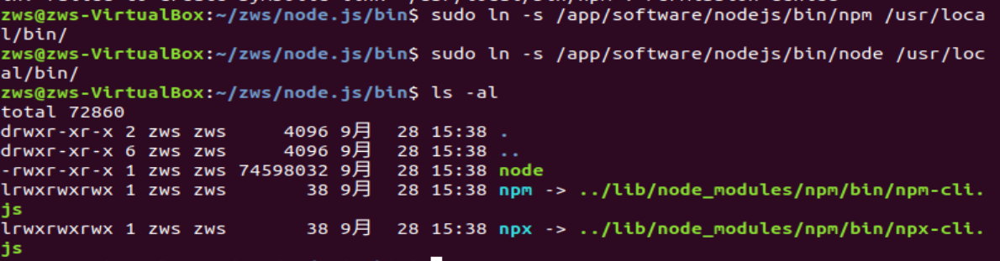

#              Ubunt 安装Node.js

打开终端

第一步：查看自己应该安装什么版本的Node

```
uname -a
```


第二步：根据需求官网下载匹配自己系统的文件：

 英文网址：https://nodejs.org/en/download/

 中文网址：http://nodejs.cn/download/


注意：可以先在自己的电脑上下载好，然后通过Xftp移动至虚拟机上，目录自行指定。


第三步：解压上传的压缩包

```
①tar -xvf  node-v14.18.0-linux-x64.tar.xz  
```


```
② mv  node-v14.18.0-linux-x64  nodejs 
```


```
③确认一下nodejs下bin目录是否有node 和npm文件，如果有执行下一步，如果没有重新下载执行上边步骤；
```


第四步：建立软连接，变为全局

```
①sudo ln -s /app/software/nodejs/bin/npm /usr/local/bin/ 
```

```
②ln -s /app/software/nodejs/bin/node /usr/local/bin/
```



第五步：检查一下


第六步：报错后执行

```
sudo apt install nodejs
```


第七步：检查确认

